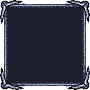

# Monochrome Palette Generator

Tek bir renk tonundan (hue) yola çıkarak **21 farklı açıklık (lightness) kademesi** üreten, tarayıcıda çalışan hafif bir paleti oluşturma aracı. Seçtiğin hue ve saturation değerlerine göre `%0`'dan `%100`'e kadar `%5` aralıklarla monokrom bir gradyan palet çıkarır; herhangi bir kartın üstüne tıklayarak HEX kodunu panoya kopyalayabilirsin.

## Özellikler

- **Canlı önizleme:** Hue ve saturation kaydırıcılarını oynattıkça 21 kart anında yeniden render edilir.
- **Monokrom palet:** Tek hue + tek saturation sabitlenir, yalnızca lightness değişir — bir tasarım sistemine uygun ton ölçeği çıkarmak için idealdir.
- **HSL → HEX dönüşümü:** Renkler HSL ile üretilir, kartlarda HEX olarak gösterilir.
- **Tek tıkla kopyalama:** Karta tıkla → HEX kodu clipboard'a düşer, kart kısa süreli `Copied!` geri bildirimi verir.
- **PNG export:** Paleti tek piksel yüksekliğinde, 21 piksel genişliğinde PNG olarak indirir (her pikselde bir lightness kademesi).
- **Akıllı kontrast:** Lightness `%55`'in üstündeyse yazı siyah, altındaysa beyaz gösterilir — her kartta metin her zaman okunur.
- **Dinamik saturation kaydırıcısı:** Saturation slider'ının arka plan gradyanı seçili hue'ya göre güncellenir, ne seçtiğini görsel olarak hissedersin.

## Örnek

Aracın ürettiği monokrom paletin pratik kullanımı — aşağıdaki 9-slice sprite, **v1.0.0**'da üretilen bir HSL paletinin lightness kademeleri kullanılarak çizildi:



Çerçevenin kenar ve köşelerindeki gölge/ışık geçişleri, tek hue boyunca artan lightness değerlerine denk gelir — bu yüzden tek ton üzerinden hacim hissi tutarlı çıkar.

## Teknoloji

- [Vite](https://vitejs.dev/) 8 — dev server ve bundler
- [Jimp](https://github.com/jimp-dev/jimp) — PNG üretimi (tarayıcıda)
- [vite-plugin-node-polyfills](https://github.com/davidmyersdev/vite-plugin-node-polyfills) — Jimp'in Node API'lerini tarayıcıya uyarlar
- Vanilla JavaScript (ES modules)
- HTML + CSS

## Kurulum

```bash
cd monochrome-palette-generator
npm install
```

## Çalıştırma

```bash
npm run dev       # geliştirme sunucusu
npm run build     # production build (dist/)
npm run preview   # build'i local'de önizle
```

Dev server ayağa kalktıktan sonra terminalde çıkan `localhost` adresini tarayıcında aç.

## Proje Yapısı

```
monochrome-palette-generator/
├── index.html
├── package.json
├── vite.config.js                  # Jimp için polyfill ve alias ayarları
├── src/
│   ├── main.js                     # Giriş noktası; yalnızca barrel'lardan import eder
│   ├── style.css
│   ├── logics.js                   # logic/ barrel — main.js buradan çağırır
│   ├── renders.js                  # render/ barrel
│   ├── inputs.js                   # input/ barrel
│   ├── logic/
│   │   ├── hslToHex.js             # HSL → HEX dönüşümü
│   │   ├── getContrastColor.js     # Lightness'a göre siyah/beyaz metin rengi
│   │   ├── generatePalette.js      # (h, s) → 21 adımlık HEX dizisi
│   │   └── paletteToPng.js         # HEX dizisi → PNG Blob (Jimp ile)
│   ├── render/
│   │   ├── renderPalette.js        # 21 kartı üretip DOM'a basar
│   │   ├── createColorCard.js      # Tek bir kart + tıklama davranışı
│   │   └── downloadBlob.js         # Blob'u tarayıcıdan dosya olarak indirtir
│   └── input/
│       ├── getElements.js          # DOM referanslarını toplar
│       ├── readInputs.js           # Slider değerlerini parse eder
│       ├── updateInputDisplay.js   # Label'ları ve saturation gradyanını günceller
│       ├── bindInputs.js           # Slider event listener'larını bağlar
│       └── bindExport.js           # Export butonu listener'ını bağlar
└── README.md
```

**İçe aktarma akışı:** Her alt klasördeki fonksiyon önce kendi barrel dosyasına (`logics.js` / `renders.js` / `inputs.js`) re-export edilir, `main.js` ise sadece bu üç barrel'dan import eder. Alt klasör yolları dışarıya sızmaz.

## Nasıl Çalışır

1. `getElements()` tüm DOM referanslarını tek bir nesnede toplar — [src/input/getElements.js:1](src/input/getElements.js#L1).
2. `bindInputs()` iki slider'a `input` event listener'ı bağlar; her değişiklikte `update()` callback'i tetiklenir — [src/input/bindInputs.js:1](src/input/bindInputs.js#L1).
3. `readInputs()` slider değerlerini integer olarak okur → `{ h, s }` — [src/input/readInputs.js:1](src/input/readInputs.js#L1).
4. `updateInputDisplay()` hue/sat label'larını günceller ve saturation slider'ının arka plan gradyanını seçili hue'ya göre yeniler — [src/input/updateInputDisplay.js:1](src/input/updateInputDisplay.js#L1).
5. `renderPalette()` container'ı temizler, `LIGHTNESS_STEPS` boyunca `createColorCard()` çağırır — [src/render/renderPalette.js:4](src/render/renderPalette.js#L4).
6. `createColorCard()` tek bir kart üretir; `hslToHex()` ile rengi, `getContrastColor()` ile metin rengini hesaplar, kopyalama davranışını bağlar — [src/render/createColorCard.js:3](src/render/createColorCard.js#L3).
7. **Export** butonuna basılınca `generatePalette(h, s)` 21 HEX döner → `paletteToPng()` Jimp ile 21×1 PNG Blob üretir → `downloadBlob()` `palette-h{h}-s{s}.png` olarak indirtir — [src/main.js:15](src/main.js#L15).

## Kullanım İpuçları

- **Hue** kaydırıcısı `15°` aralıklarla hareket eder — renk tekerleğini 24 eşit parçaya böler.
- **Saturation** kaydırıcısı `5%` adımlarla değişir; `0`'a çekersen gri tonlamalı bir nötr ölçek elde edersin.
- UI tam sayfa (viewport) yerleşimi kullanır, scroll yoktur — 21 kart tek satırda grid olarak dizilir.

## Sürümler

### v1.1.0

**Kazanım:** PNG export.

**Neden çıkıldı:**
- Palet kartları sadece ekranda gösteriliyor, HEX kodlarını tek tek kopyalamak dış araçlara (Aseprite, Photoshop, Figma) aktarırken zayıf bir akış üretiyor.
- Pixel art / 9-slice gibi pipeline'larda paleti dosya olarak içe aktarmak çok daha hızlı; tek bir PNG satırı `Palette → Import` akışına birebir uyuyor.

**Ne geldi:**
- Arayüzde **Export PNG** butonu.
- Tıklandığında aktif `(h, s)` değerinden üretilen 21 renk, `21×1` piksellik bir PNG'ye yazılır ve `palette-h{h}-s{s}.png` olarak indirilir.
- Kod tarafında palet üretimi render'dan ayrıldı: `generatePalette()` tek kaynak haline geldi, hem ekran render'ı hem de export aynı diziyi kullanıyor.

**Teknik seçimler:**
- Tarayıcıda PNG üretimi için `jimp` tercih edildi; canvas yerine Jimp seçilmesinin sebebi ileride (çok satırlı spritesheet, çerçeve/grid, anti-alias'sız piksel çıktısı) daha kontrollü bir pipeline'a uzatılacak olması.
- Jimp'in Node API bağımlılıkları (`Buffer`, `stream`) için `vite-plugin-node-polyfills` ve yeni `vite.config.js` eklendi.
